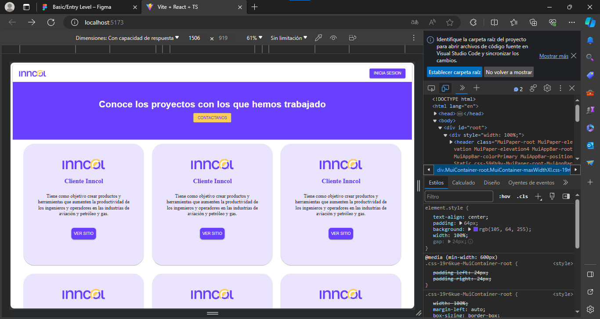
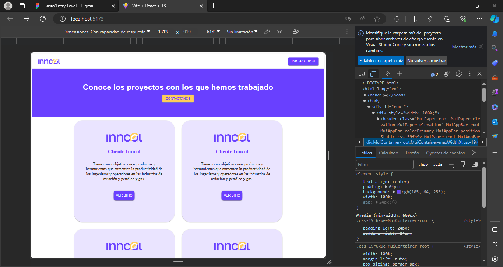
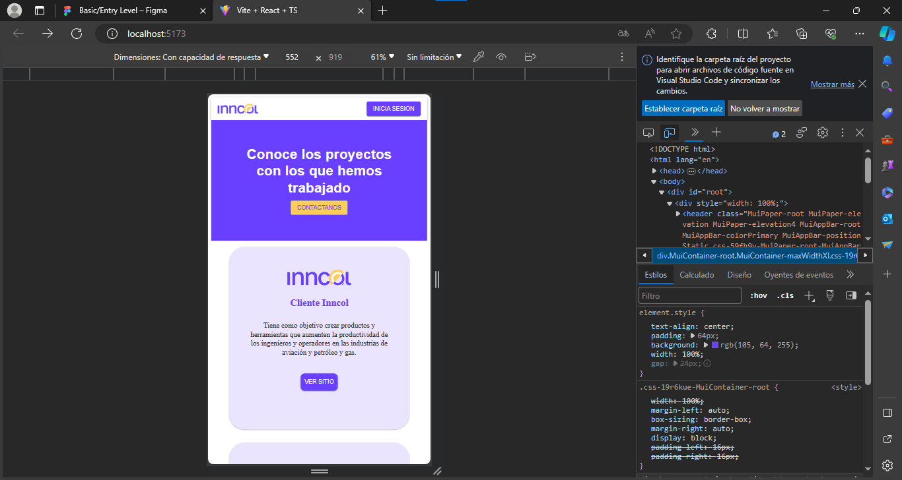

Este proyecto React utiliza Create React App con TypeScript y Material-UI.

## Pasos para Configurar el Proyecto

### - **Instalar Create React App**

Asegúrate de tener Node.js y npm instalados. Luego, instala Create React App globalmente:
```bash
npm install -g create-react-app
```
## Crear un Nuevo Proyecto React
En el mismo directorio
```bash
npm create vite@latest .
```
## Navegar al Directorio del Proyecto
```bash
cd Incool-Prueba
```
## Instalar Material-UI:
Instala Material-UI y las dependencias necesarias:
```bash
npm install @mui/material @emotion/react @emotion/styled
```
```bash
npm install @fontsource/roboto
```
```bash
npm install @mui/icons-material
```

## Iniciar la Aplicación
```bash
npm run dev
```
```bash
Abrir [http://localhost:5173/]
```

## Estructura de Carpetas y Archivos
- **node_modules/:** Carpeta que contiene las dependencias del proyecto.
- **public/:** Contiene archivos estáticos que se copiarán directamente en la carpeta de compilación.
- **src/:** Contiene el código fuente de la aplicación.
  - **assets/:** Almacena archivos multimedia como imágenes, fuentes, etc.
  - **components/:** Aquí van los componentes React reutilizables.
  - **pages/:** Cada archivo generalmente corresponde a una página o vista en tu aplicación.
  - **App.css:** Estilos específicos para el componente principal de la aplicación.
  - **App.tsx:** Componente principal de la aplicación.
  - **index.css:** Estilos globales para la aplicación.
  - **index.tsx:** Archivo principal donde se monta la aplicación.
 - **.gitignore:** Archivo que especifica los archivos y carpetas que se deben ignorar al realizar el seguimiento con Git.
- **package.json:** Archivo de configuración de npm que contiene metadatos del proyecto y las dependencias.
- **tsconfig.json:** Configuración del compilador TypeScript.
- **README.md:** Documentación del proyecto que proporciona instrucciones y detalles sobre el proyecto.

#### Capturas de Pantalla 
<p align="center">



</p>

### Si has clonado el proyecto, después de navegar al directorio del proyecto, debes ejecutar los siguientes comandos para instalar las dependencias:
```bash
cd Incool-Prueba
```
```bash
npm install
```
### Esto instalará todas las dependencias del proyecto que están definidas en el archivo package.json. Después de eso, puedes ejecutar el comando npm start para iniciar la aplicación.

```bash
npm run dev
```

